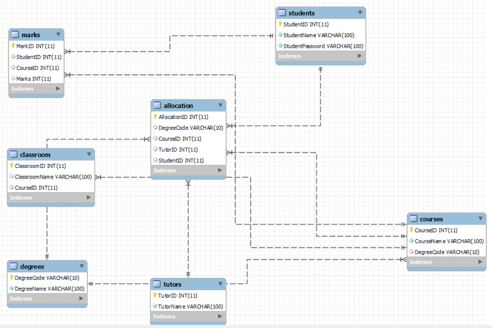

# MySQL Database Project

Welcome to the MySQL Database Project repository. This project contains SQL scripts and sample data for a comprehensive MySQL database designed for various use cases.

## Table of Contents

- [Project Overview](#project-overview)
- [Database Schema](#database-schema)
- [Setup and Installation](#setup-and-installation)
- [Sample Data](#sample-data)
- [Queries](#queries)
- [Contributing](#contributing)
- [License](#license)
- [Contact](#contact)

## Project Overview

This project aims to provide a fully functional MySQL database schema complete with sample data, stored procedures, and complex queries. It can be used as a reference or starting point for new database projects, learning, and experimentation.

## Database Schema

The database schema includes the following tables:

- **Students**: Stores student information.
- **Tutors**: Stores tutor information.
- **Courses**: Stores course information.
- **Degrees**: Stores degree information.
- **Allocations**: Stores the allocation of tutors to courses and students.
- **Marks**: Stores students' marks for different courses.
- **Classrooms**: Stores information about classrooms.

### Entity-Relationship Diagram (ERD)

 

## Setup and Installation

To set up the database on your local machine, follow these steps:

1. **Clone the repository:**
    ```sh
    git clone https://github.com/yourusername/mysql-database-project.git
    cd mysql-database-project
    ```

2. **Create the database and tables:**
    ```sh
    mysql -u yourusername -p < create.sql
    ```

3. **Insert sample data:**
    ```sh
    mysql -u yourusername -p < insert.sql
    ```

## Sample Data

The repository includes sample data for testing and development purposes. The `insert.sql` file contains SQL statements to populate the database with sample data.

## Queries

This repository also includes various SQL queries for different operations, such as:

- Retrieving all students with their corresponding tutors and courses.
- Finding the highest marks obtained by students.
- Listing all courses and their assigned tutors.

### Example Query

To find the highest marks obtained by each student, use the following query:

```sql
SELECT s.StudentID, s.StudentName, MAX(m.Marks) AS HighestMarks
FROM Students s
RIGHT JOIN Marks m ON s.StudentID = m.StudentID
GROUP BY s.StudentID, s.StudentName;
